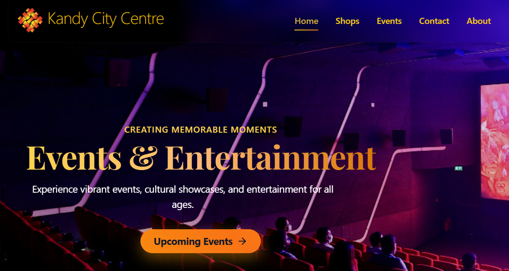
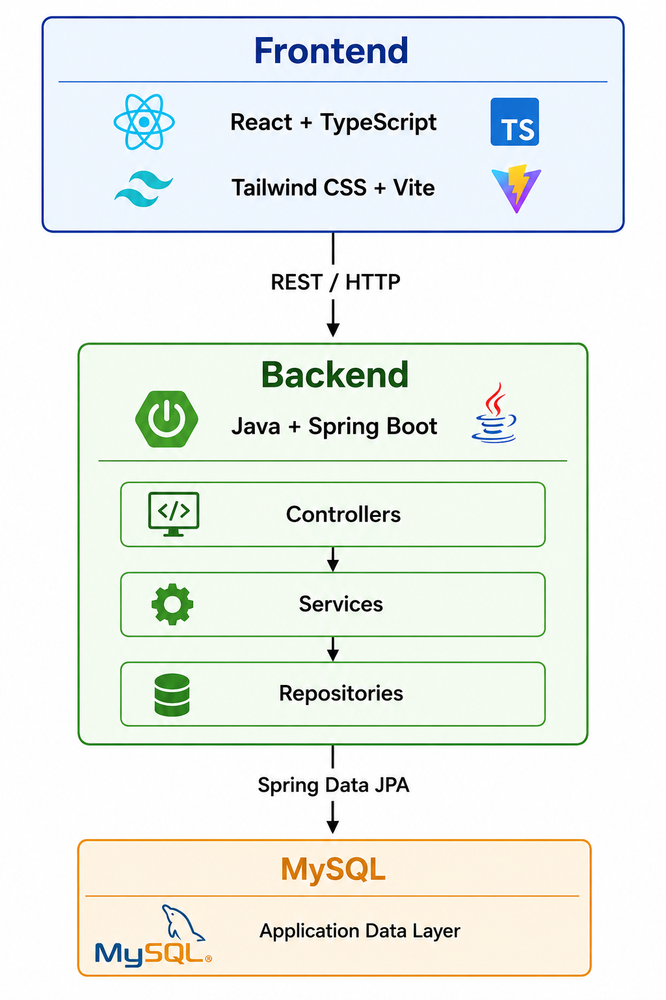
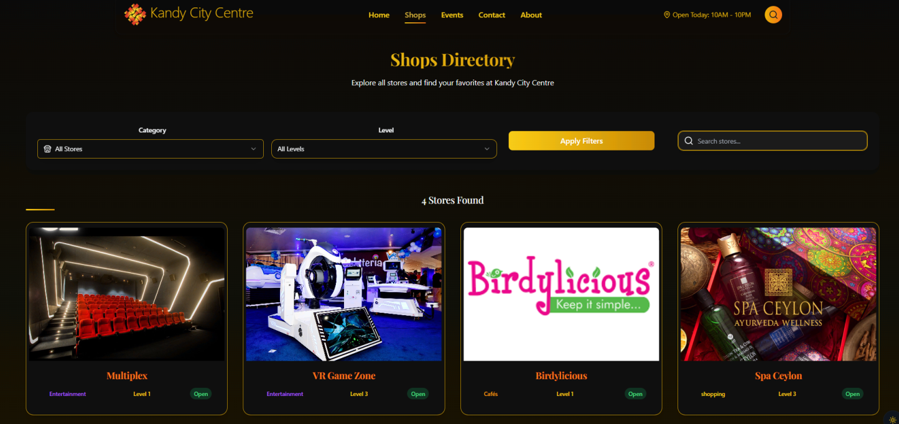
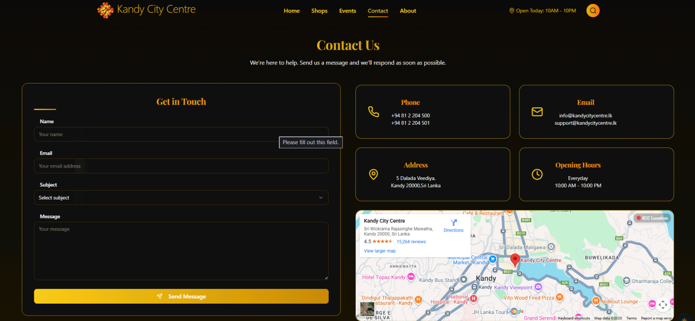
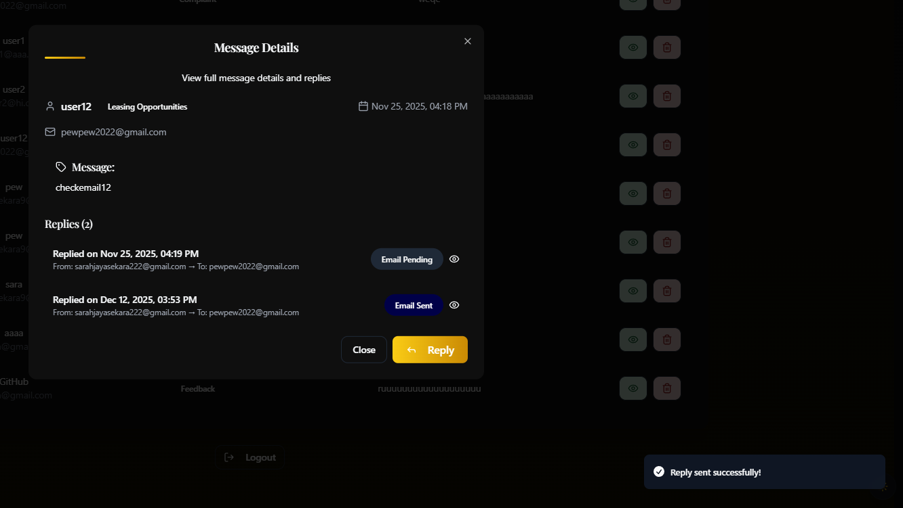
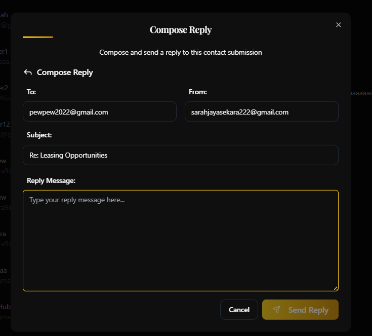

# 🏬 Kandy City Centre 
## An Interactive Web Application for Shopping Malls



A full-stack web platform developed for **Kandy City Centre (KCC)** as a third-year Computer Science team project at the **University of Peradeniya**.

This was designed to modernize the shopping-mall experience by providing visitors with convenient access to shops, events, promotions, mall information, navigation, and customer services through a single digital platform.
<br><br>

# 🔐 Source Code & Confidentiality Notice

The original development repository is **private and cannot be publicly distributed due to confidentiality and non-disclosure obligations associated with the project**.

This public repository is maintained solely as a **portfolio showcase** to demonstrate:

- The problem addressed
- Overall system functionality
- Technology stack and architecture
- My individual technical contributions
- Testing and development experience

No private source code, credentials, `.env` files, internal configuration, or other confidential project materials are included in this repository.

### All screenshots and information presented here are limited to materials appropriate for public portfolio demonstration.
<br><br>

## 📌 Project Overview

The project was developed to transform KCC's static web presence into a more dynamic and interactive platform for visitors and mall management.

The complete system provides functionality for:

- Shop browsing and discovery
- Shop search and category filtering
- Shop availability and operating information
- Interactive mall navigation
- Events and promotions
- User and role management
- Shop-owner functionality
- Administrative management
- Customer inquiries and feedback
- Direct email communication with visitors
- Responsive access across devices


The broader project concept focuses on making mall information and services easier to access digitally.

### 🛍️ Online Shop Browsing

Visitors can explore shops and access relevant shop information without needing to physically search through the mall.

### 🎉 Events & Promotions

The platform provides information about upcoming events, special promotions, offers, and other mall updates.

### 🗺️ Interactive Mall Navigation

The system was designed to help visitors locate shops and navigate through the mall more efficiently.

### 🕒 Shop Availability

Visitors can access shop availability and operating-hour information to better plan their visits.

---

# 👩‍💻 My Contributions

The complete application was developed collaboratively as a team project.

**My primary responsibility was the design and implementation of the Shops Directory and Customer Communication System.**

---

## 🔎 1. Shops Directory & Search

Developed the shop discovery functionality that allows visitors to browse and locate shops efficiently.

### Key functionality

* Displayed available shops through a responsive directory
* Implemented search by shop name
* Supported category-based shop discovery
* Integrated the React interface with backend shop APIs
* Retrieved shop information dynamically from MySQL
* Implemented case-insensitive searching
* Handled searches with no matching results

### Search Flow

```text
User Search
    │
    ▼
React + TypeScript
    │
    │ HTTP Request
    ▼
Spring Boot REST API
    │
    ▼
Service / Repository
    │
    ▼
MySQL
    │
    ▼
Matching Shop Data
    │
    ▼
Responsive Shop Cards
```

The search is processed on the backend rather than requiring the frontend to retrieve the complete shop dataset before filtering.

This provides a cleaner separation between the presentation, business-logic, and data-access layers.

---

## 💬 2. Customer Communication System

Developed a communication workflow that allows visitors to contact KCC management directly through the web application.

### Visitor Side

Visitors can:

* Submit an inquiry through the **Contact Us** interface
* Provide their name and email
* Specify an inquiry subject
* Submit questions, feedback, or complaints

The submitted information is transferred through the backend API and persisted in the database.

### Admin Side

Administrators can:

* View incoming customer inquiries
* View individual message details
* Identify unresolved and resolved inquiries
* Reply to visitors from the administration interface
* Maintain a record of customer communications

---

## 📧 3. SMTP Email Reply Integration

Integrated an email communication mechanism using **Spring Boot JavaMailSender and SMTP**.

This enables administrators to respond to customer inquiries directly from the system.

```text
Visitor
   │
   │ Submit Inquiry
   ▼
Contact Us
   │
   ▼
Spring Boot REST API
   │
   ▼
MySQL Database
   │
   │ Stored Inquiry
   ▼
Admin Dashboard
   │
   │ Write Reply
   ▼
Spring Boot Email Service
   │
   ▼
SMTP Server
   │
   ▼
Visitor's Email Inbox
```

After a reply is sent, the communication record can be updated to reflect its resolved/replied status.

This creates a complete feedback loop between visitors and KCC management.

---

# 🏗️ System Architecture

The application follows a layered full-stack architecture.



# 🛠️ Technology Stack

## Frontend


* React
* TypeScript
* Vite
* Tailwind CSS
* shadcn/ui
* React Router
* Axios
* React Query
* Framer Motion

## Backend


* Java
* Spring Boot
* Spring Data JPA
* Spring Security
* REST APIs
* JavaMailSender
* Maven

## Database


* MySQL

## Development & Testing

* Git
* GitHub
* Postman
* Maven
* npm

---

# 🗄️ Data Model

The modules I worked on primarily interact with the following entities.

### `Shop`

Stores information used by the Shops Directory, such as:

* Shop name
* Category
* Floor/level
* Contact details
* Shop images
* Visibility and availability information

### `Contact`

Stores inquiries submitted by visitors:

* Name
* Email
* Subject
* Message
* Submission timestamp
* Resolution status

### `ContactReply`

Maintains information associated with administrator responses:

* Original inquiry reference
* Reply content
* Recipient information
* Sender information
* Email delivery information

---

# 🧪 Testing & Validation

The modules were tested at multiple levels during development.

### Unit Testing

Backend functionality was tested individually, including repository search behavior and email-service functionality.

### API Integration Testing

REST APIs were tested using **Postman** before integration with the React frontend.

Tests included:

* Shop search requests
* Contact-form submissions
* Response validation
* Database persistence

### System Testing

End-to-end workflows were also tested through the user interface.

Test scenarios included:

* Searching by shop name
* Searching by category
* Case-insensitive searches
* Invalid/no-result searches
* Submitting customer inquiries
* Viewing inquiries from the Admin Dashboard
* Sending email replies
* Preventing empty replies
* Confirming external email delivery
* Updating inquiry status after a response

---

# 📸 Application Preview

## Shops Directory

The Shops Directory provides search and filtering controls together with responsive shop cards.

 


## Customer Inquiry
Visitors can submit inquiries, feedback, and other messages through the Contact Us interface.




## Admin Dashboard
The administration interface provides centralized access to visitor inquiries and their current status.



## Email Reply System

Administrators can respond to visitor inquiries through the application's integrated email functionality.



---

# 📚 What I Learned

This project provided hands-on experience with:

* Developing a full-stack application using React and Spring Boot
* Designing and consuming RESTful APIs
* Implementing server-side search functionality
* Working with relational data using MySQL and Spring Data JPA
* Connecting frontend interfaces with backend services
* Implementing SMTP-based email communication
* Managing application state and asynchronous API requests
* Testing APIs using Postman
* Debugging frontend/backend integration issues
* Working collaboratively with Git and GitHub
* Integrating independently developed modules into a larger application

---

# 🚀 Future Improvements

Potential improvements to the platform include:

* 🤖 AI-powered mall assistant
* 🔎 Fuzzy and typo-tolerant shop search
* 🌐 Sinhala and Tamil language support
* 🔔 Real-time notifications
* 👤 Visitor accounts and inquiry history
* 🎁 Digital loyalty programme
* 🛒 Click-and-collect marketplace
* 📊 Enhanced management analytics

---

# 👥 Project Context

**Project:** An Interactive Web Application for Kandy City Centre
**Year:** 2025
**Institution:** University of Peradeniya
**Project Type:** Third-Year Computer Science Team Project

## Team

The complete platform was developed collaboratively by a four-member team at the University of Peradeniya.

### Team Members

- **Sarathi Jayasekara**
- **Samith Nandasiri**
- **Thilini Chathurika**
- **Sachin Kalhara**

This showcase highlights my individual contributions while acknowledging the collaborative effort behind the complete platform.

### Scope of My Work

My documented individual contribution primarily covered:

**Shops Directory**

* Shop directory interface
* Shop search
* Category-based discovery
* Backend search integration

**Customer Communication**

* Contact Us workflow
* Inquiry persistence
* Admin message management
* SMTP email integration
* Reply/status management

**Testing**

* API integration testing
* Functional/system testing of my modules

Other major components of the complete system were developed collaboratively or by other team members.

---


